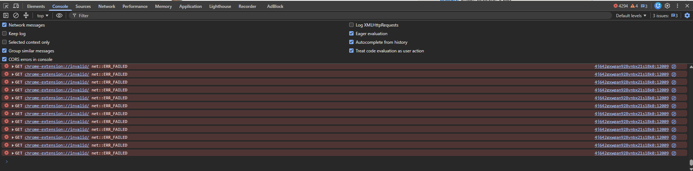
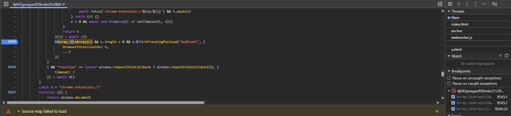
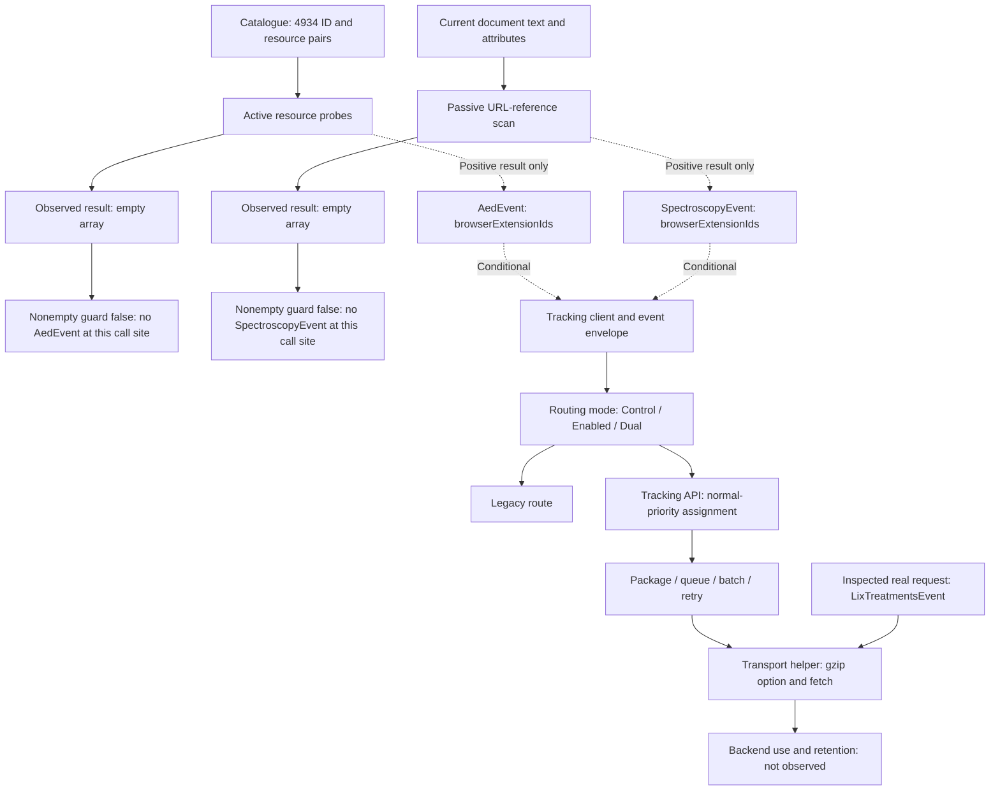

# Reverse Engineering LinkedIn’s Browser Extension Detection Pipeline

**A DevTools investigation of 4,934 probe targets, two detection mechanisms, and the boundary between collection capability and observed transmission.**

Investigation record: 12 September 2026 · Public sources checked: 12 September 2026

While browsing LinkedIn, I noticed thousands of failed `chrome-extension://invalid/` requests in Chrome DevTools. Following their initiator led to a catalogue of extension IDs and resource paths, two detection functions, and dedicated telemetry events. I then traced the shared tracking infrastructure through routing, batching, request packaging and its final `fetch()` implementation.

The result requires two statements together: **the captured client was designed to probe 4,934 extensions and report positive results; both detectors returned empty arrays in my test.** I did not observe an extension ID being transmitted. The real request inspected at the final transport step carried a different event, `LixTreatmentsEvent`.

This case study reconstructs the investigation from saved DevTools output, source excerpts, screenshots and the exported catalogue. I performed the browser investigation with AI-assisted guidance. AI also assisted with catalogue analysis and drafting; the resulting analysis was checked against the recorded artifacts. It is a client-side investigation, not a backend audit or a claim of first discovery.

## What the evidence establishes

| Finding | Evidence level | Boundary |
|---|---|---|
| The exported catalogue contains 4,934 unique extension IDs and one path per ID. | Direct artifact measurement | A target list, not an installed-extension inventory. |
| Active detection iterates that list and attempts extension-resource fetches. | Captured source plus runtime probe output | No complete packet-by-packet capture of all 4,934 attempts was retained. |
| Passive detection traverses document text and attributes for extension URL references. | Captured source | A reference is a detection signal, not proof of installation. |
| Nonempty results populate `browserExtensionIds` in `AedEvent` or `SpectroscopyEvent`. | Captured source | These call sites suppress events when the array is empty. |
| Both detector result arrays were `[]`. | Saved runtime console output | Specific to the inspected executions and environment. |
| Both event-name lookups selected `normal-priority`. | Runtime routing inspection | Feature flags can still select the legacy route, the newer route, or both. |
| The transport code reaches browser `fetch()`; an inspected request used JSON packaging and gzip configuration. | Captured implementation and runtime arguments | That request contained `LixTreatmentsEvent`; extension-event transmission was not observed. |

The [evidence ledger](evidence/README.md) connects each finding to its source. The [catalogue report](analysis/catalog-analysis.md) and [offline analyzer](scripts/analyze_catalog.py) make the numerical findings reproducible.

## 1. Starting with the failed requests

The initial symptom was repeated console output of this form:

```text
GET chrome-extension://invalid/ net::ERR_FAILED
```



*Figure 1. Original DevTools screenshot. The error counter includes console errors generally; it is not used to establish the catalogue size.*

Clicking an initiator first exposed a wrapper around `window.fetch`. That wrapper was not enough to explain the requests. Inspecting its arguments and following the caller revealed URLs built from specific extension IDs and paths. This changed the question from “Which extension is broken?” to “Which page code is testing these extension resources?”

The saved probe log contains **175 distinct, valid extension-ID URLs**, starting at the beginning of the exported list. The exact 4,934 figure comes from `o.length`, the complete JSON export, and the loops in the source. Together they establish a 4,934-target probing design and observed execution of that design. They do not provide an independently retained network entry for every target or prove that all requests reached a resource handler.

## 2. Active detection: testing known resources

Each catalogue entry has exactly two fields:

```json
{
  "id": "aaaeoelkococjpgngfokhbkkfiiegolp",
  "file": "icon/16.png"
}
```

The ID identifies a candidate extension; the path supplies a resource to try. Neither field says that the extension is installed in the current browser.

The parallel branch below is a readability adaptation of the captured source: variable names and formatting are changed, while the success predicate is preserved. The [original detector excerpt](evidence/detectors.js) is included separately.

```js
async function detectKnownExtensions(catalog) {
  const detected = [];
  const requests = catalog.map(({ id, file }) =>
    fetch(`chrome-extension://${id}/${file}`)
  );
  const results = await Promise.allSettled(requests);
  results.forEach((result, index) => {
    if (result.status === "fulfilled" && result.value !== undefined) {
      const entry = catalog[index];
      if (entry) detected.push(entry.id);
    }
  });
  return detected;
}
```

The observed code also has a sequential alternative: it awaits each fetch, records a truthy result, catches errors, and optionally waits between targets using `staggerDetectionMs`. A separate option schedules detection through `requestIdleCallback`. Its `timeout` is the idle-callback scheduling option, **not a per-fetch network timeout**. The recorded stack trace includes `requestIdleCallback` and the sequential-loop location, but the exact configured delay was not retained.

The parallel predicate does not inspect `Response.ok`, an HTTP status, or a response body. The reported signal is a fulfilled, non-`undefined` fetch result under the captured implementation. The code shown does not read extension settings, passwords or arbitrary files from the computer.

Chrome’s documentation explains the underlying boundary: extension resources are not web-accessible by default. Declared resources can be exposed to selected origins and requested with `fetch()`; extensions can also require dynamic resource IDs. Chrome explicitly identifies extension fingerprinting as a reason to restrict access. A fixed-ID probe can therefore miss an installed extension when the resource, version, exposure rules or URL scheme requirements differ. [Chrome: Web Accessible Resources](https://developer.chrome.com/docs/extensions/reference/manifest/web-accessible-resources)

## 3. Passive detection: reading references already in the document

The second function starts at `window.document` and recursively walks `childNodes`. It examines text-node content and every attribute on element nodes for the string `chrome-extension://`.

Its extractor is small enough to show directly, with descriptive variable names:

```js
function extractExtensionToken(text) {
  const prefix = "chrome-extension://";
  const index = text.indexOf(prefix);
  return index === -1
    ? ""
    : text.substring(index + prefix.length).split("/")[0];
}
```

Unlike active probing, this function does not consult the 4,934-entry catalogue. It collects tokens from references already present in the traversed document. “Passive” describes how it obtains the signal; it does not mean the signal cannot be reported.

The implementation has consequential limits. It does not validate that an extracted token is a 32-character extension ID, deduplicate results, or authenticate the origin of a reference. A quoted URL or stale page attribute could match. It extracts the first occurrence in each inspected string. The shown recursion also does not explicitly enter shadow roots or iframe documents. These details matter when interpreting a future positive result.

## 4. Event creation—and the empty arrays

The two event guards appear directly in the captured code:

```js
Array.isArray(n) && n.length > 0 && e.fireTrackingPayload("AedEvent", {
    browserExtensionIds: n,
    ...t
})

Array.isArray(n) && n.length > 0 && e.fireTrackingPayload("SpectroscopyEvent", {
    browserExtensionIds: n,
    ...t
})
```

Here `t` is additional metadata; the recorded detector output showed `{accountType: 'FLAGSHIP'}`. Because metadata is spread after `browserExtensionIds`, it could technically override that property if a caller supplied the same key. No such override appears in the recorded metadata.



*Figure 2. Original DevTools screenshot of the active event guard. This screenshot establishes the code location, not the value of the result array.*

The saved console outputs, condensed to their relevant fields, were:

```text
DETECTED: []     COUNT: 0     METADATA: {accountType: 'FLAGSHIP'}
SPECTROSCOPY: [] COUNT: 0     METADATA: {accountType: 'FLAGSHIP'}
```

Both executions reached the inspected result points with zero collected IDs. Given the guards, those executions would not call these event emitters. This does **not** prove that the browser had no extensions, that every installed extension was undetectable, or that no other telemetry was collected. It means these two recorded executions produced no extension identifiers.

I also reported seeing probing in an Incognito session while signed into LinkedIn. That was an informal repetition, not a separately preserved controlled trial; the two zero-result records are not assigned to separate normal/Incognito conditions. Chrome exposes a per-extension “Allow in incognito” setting, so browsing mode and extension configuration need to be recorded independently in any comparison. [Chrome extension management help](https://support.google.com/chrome_webstore/answer/2664769?hl=en)

## 5. Following the tracking pipeline

The bridge from the detector to the tracking client was:

```js
fireTrackingPayload(e, t, i, n, o) {
    return this._trackingClient.fireEvent(e, t, i, n, o)
}
```

Inspecting inherited methods, rather than stopping at the first wrapper, revealed event-envelope generation, delegate processing and transporter selection. The selected transporter's `fireEvent` method either prepared a context-bearing envelope for its queue or held it in a pre-context queue. Subsequent flushing packaged event bodies and consulted routing decisions.

The routing code distinguishes `Control`, `Enabled` and `Dual` modes. A valid transporter lookup answers **where an event would be assigned on that route**; it does not by itself answer whether that route is enabled for a particular event. In dual mode the source shows both the newer tracking API path and legacy handling.

Both runtime lookups produced the same assignment:

```text
getTransporterForEvent("AedEvent")          → normal-priority
getTransporterForEvent("SpectroscopyEvent") → normal-priority
```

The inspected request manager had `batchSize: 30` and `flushDebounceDelayMs: 10000`. Its `packageRequest` method added valid packaged events to a queue and called `attemptToFlush`. That method flushed at the size threshold or scheduled a timer; `flushEvents` separated retry and non-retry payloads. These are captured configuration values, not a guarantee that every batch has 30 events or that every request waits exactly ten seconds.

Following `sendWithRetry`, `beaconFunc`, the request object's `send`, and the underlying transport helper reached ordinary `fetch()`. The helper first requested `keepalive: true` and retried with `keepalive: false` on rejection. The method name `beaconFunc` therefore does not establish use of `navigator.sendBeacon`.

At the final inspection point the arguments included a JSON request envelope, `compress: true`, and a `content-encoding: gzip` header. That establishes gzip configuration in the transport path. No independent compressed-byte capture or server receipt was retained, and the adjacent `compressToBase64` utility is not proof that every extension event passes through that utility. Base64 encoding, gzip compression and encryption are distinct operations.

### Endpoint roles observed in this session

| URL | What was actually inspected | What it does not establish |
|---|---|---|
| `https://www.linkedin.com/SYRSLV_ku8fKe` | `trackingEndpoint` and `getTrackingEndpoint()` on the legacy transporter. | No extension-event delivery to this URL was captured. |
| `https://www.linkedin.com/tapiGObKhoLQkiNZ` | Request-manager endpoint returned with the `normal-priority` assignment for both extension event names. | The lookup alone does not establish the event's route mode or transmission. |
| `https://www.linkedin.com/tlixkTL1sepuSXT8` | URL in the real request arguments inspected at the final transport helper. The body named `LixTreatmentsEvent`. | This was not evidence of an `AedEvent` or `SpectroscopyEvent` payload leaving the browser. |

These opaque paths are retained exactly as observed, without query parameters, cookies or account data. They should not be treated as stable APIs or universal blocking rules. Their naming and lifetime cannot be determined from this session.



*Figure 3. Reconstructed architecture. Dotted edges are conditional positive-result paths, not events observed in this test. Solid arrows in the transport portion describe inspected control flow, not proof of successful delivery for every event.*

## 6. What is in the catalogue?

The complete export contains **4,934 rows, 4,934 unique IDs, 4,934 unique ID/path pairs and 2,487 distinct paths**. The IDs are sorted lexicographically. The JSON contains only `id` and `file`: no names, publisher descriptions, categories, versions, installation counts or reasons for inclusion.

| Probed resource suffix | Entries | Share |
|---|---:|---:|
| PNG | 2,308 | 46.78% |
| JavaScript (`.js`) | 854 | 17.31% |
| HTML (`.html`) | 808 | 16.38% |
| CSS | 507 | 10.28% |
| All other suffixes, including `.mjs` | 457 | 9.26% |

*Shares rounded independently.* The most common exact path is `icons/icon16.png`, appearing 407 times. Such a path says almost nothing about what an extension does. A `.js` target likewise does not mean the script was executed: the detector shown only examines the fetch outcome.

### Exact-ID examples, independently checked against public listings

The following is a **purposeful sample of ten entries**, selected to check the breadth suggested in the original investigation. It is not random or representative. Each name links to the listing with the exact ID found in the captured file. Descriptions summarize the publishers’ stated functionality, not an audit of their code.

| Catalogue row | Extension | Captured path | Functional category |
|---:|---|---|---|
| 1 | [Pictory](https://chromewebstore.google.com/detail/text-to-video-ai-video-cr/aaaeoelkococjpgngfokhbkkfiiegolp) | `icon/16.png` | AI video creation |
| 223 | [Apollo.io](https://chromewebstore.google.com/detail/apolloio-free-b2b-phone-n/alhgpfoeiimagjlnfekdhkjlkiomcapa) | `panel.html` | Sales and contact intelligence |
| 601 | [JobCopilot](https://chromewebstore.google.com/detail/jobcopilot/bnnacanndojemikeabbdejlamlecikcn) | `icon.png` | Job-application autofill |
| 1541 | [No more Musk](https://chromewebstore.google.com/detail/no-more-musk/falhpchopibmclpaifgelllffmjagkch?hl=en) | `icon16.png` | Feed/content filtering |
| 1791 | [ZoomInfo](https://chromewebstore.google.com/detail/zoominfo/fofjcndophjadilglgimelemjkjblgpf) | `index.html` | Sales and contact intelligence |
| 2590 | [Malwarebytes Browser Guard](https://chromewebstore.google.com/detail/malwarebytes-browser-guar/ihcjicgdanjaechkgeegckofjjedodee) | `app/assets/close-icon.svg` | Security and privacy |
| 3301 | [Jigsaw Puzzle](https://chromewebstore.google.com/detail/jigsaw-puzzle-%E2%80%94-turn-any/knhkjneccaehlklnlkdmikjggnbjnklo) | `fonts/montserrat-cyrillic-ext-wght-normal.woff2` | Games |
| 3699 | [Lusha](https://chromewebstore.google.com/detail/lusha-easily-find-b2b-con/mcebeofpilippmndlpcghpmghcljajna) | `frame.html` | Sales and contact intelligence |
| 3978 | [simplify](https://chromewebstore.google.com/detail/simplify/mpaincmooglglogamcdcidbhpclmajhj) | `cover.png` | Accessibility |
| 4425 | [PordaAI](https://chromewebstore.google.com/detail/pordaai-blur-haram-in-ima/ofhlminijomemliahkjjbgcbfoimjiaj) | `src/offscreen.html` | Faith-oriented content filtering |

These examples establish that the target list extends beyond products whose advertised primary function is LinkedIn scraping. They do not establish that the examples have no operational relevance to LinkedIn: a general-purpose extension can alter LinkedIn pages. Nor does a current store description establish what an older extension version did or which resource is currently reachable.

### Categorizing without manufacturing certainty

The analysis applies explicit filename rules to every row. The resulting overlapping hints are: LinkedIn/jobs/sales terms **115**; scraping/automation **15**; blocking/privacy **13**; email/CRM **23**; AI **21**; accessibility **4**; wallet/crypto **2**; developer/network terms **25**. Only **207 rows (4.20%)** match any rule; **4,727** match none.

These are lexical counts, **not estimates or lower bounds for functional categories**. For example, “tracking” could refer to an extension’s own analytics, and an accessibility product may have a generic icon path. False positives and false negatives both occur.

The annotated dataset consequently keeps two different fields: tentative `path_hint_tags`, and `functional_category` supported by a reviewed public listing. Ten identities, **0.20%** of the catalogue, are verified here; the other **4,924 remain unresolved**. This study supports breadth through exact examples, not claims about what proportion of all targets belongs to any product category.

## 7. Public context and LinkedIn’s explanation

This mechanism had been described publicly before this investigation. Antoine Vastel’s January 2026 analysis at Castle documents LinkedIn’s ID/resource catalogue and detection code. The BrowserGate technical report also describes the active/passive split and the same event names. Those sources provide prior-art context; their different catalogues and endpoint descriptions are not substituted for this capture. [Castle’s original analysis](https://blog.castle.io/detecting-browser-extensions-for-bot-detection-lessons-from-linkedin-and-castle/), [BrowserGate technical report](https://browsergate.eu/how-it-works/)

The BrowserGate page currently contains several counts, including 6,222 in its parallel-scan discussion. That is not the size of this export, and comparing two differently captured lists does not establish growth, shrinkage or a universal rollout. Its broader legal and motive allegations are not findings of this case study.

LinkedIn’s Privacy Policy, effective 3 November 2025 and checked for this write-up, includes browser “add-ons” under device information and describes security, fraud prevention and investigations as data uses. That is relevant disclosure, but it does not specify this catalogue’s membership, event-level retention or backend handling. [LinkedIn Privacy Policy, §§1.5 and 2.9](https://www.linkedin.com/legal/privacy-policy)

In a statement published by BleepingComputer on 3 April 2026, LinkedIn said extension detection helps identify scraping or terms violations, improve technical defenses and investigate unusually heavy retrieval of members’ data. It also stated: **“We do not use this data to infer sensitive information about members.”** This is LinkedIn’s stated explanation, reported by the publication; it is not a conclusion verified by this browser investigation. [LinkedIn statement reproduced by BleepingComputer](https://www.bleepingcomputer.com/news/security/linkedin-secretly-scans-for-6-000-plus-chrome-extensions-collects-data/)

## 8. Privacy implications and unanswered questions

Extension identifiers can expose aspects of a person’s software environment if detection succeeds. Some product descriptions concern religion, accessibility needs or job seeking. PordaAI, for example, markets its filtering for Muslims; simplify describes accessibility for neurodivergent users and other people prone to distraction. These product descriptions explain why the signals deserve care. **Installing either product would not prove a person’s religion, disability or diagnosis.** [PordaAI listing](https://chromewebstore.google.com/detail/pordaai-blur-haram-in-ima/ofhlminijomemliahkjjbgcbfoimjiaj), [simplify listing](https://chromewebstore.google.com/detail/simplify/mpaincmooglglogamcdcidbhpclmajhj)

The observed telemetry envelope includes application, page and session context. If extension results were routed through comparable account-associated infrastructure, correlation with other activity would be technically plausible. That is an architectural inference. This record does not establish storage, joining, profiling, advertising use, enforcement decisions or sharing with a particular third party.

The strongest open questions are operational and answerable:

- How are target IDs and paths selected, reviewed and removed, including general-purpose extensions?
- What minimum signal is needed for the stated security purpose: exact IDs, broader categories, or a narrower target set?
- How are stale resources, duplicate DOM references and misleading page content handled?
- What retention, access and purpose restrictions apply specifically to `browserExtensionIds`?
- How do users learn about this detection mechanism and its actual downstream uses?

These questions do not presume an unlawful purpose. Client code can demonstrate a collection mechanism; it cannot establish whether backend use is necessary, proportionate, lawful or consistent with every stated policy.

## 9. Methodology, reproducibility and limits

I used Chrome DevTools on my own signed-in LinkedIn session: initiator inspection, source search, breakpoints and result logging, prototype inspection and function-source reads. I exported the in-scope catalogue with `copy(JSON.stringify(o, null, 2))`, followed the event bridge into routing and request management, and inspected a real request at the final fetch helper. No synthetic positive extension event was needed to map the route.

The preserved sources are partial excerpts and a conversation record, not a complete immutable browser capture. Windows/Chrome context and application version `1.13.46573` appear in the recorded material, but there is no complete synchronized environment record for every execution. Breakpoints, logging and reloads also perturb timing. The long DevTools waterfall cannot be used as an uninstrumented performance benchmark.

Run the included offline analysis from the repository directory:

```sh
python scripts/analyze_catalog.py
```

It uses Python’s standard library, performs no network requests and never probes extensions. It validates the input structure, computes the digest and counts, joins exact-ID metadata, and regenerates the annotated JSON and tables. The raw catalogue’s SHA-256 is:

```text
59c7ed3ff65e7c69f6da3a7f132638ee919625702b1582b3d77064c0237147f3
```

The hash identifies these bytes; it is not a signature proving LinkedIn’s authorship. Source provenance comes from the recorded export and surrounding DevTools evidence.

Remaining limits include the absence of a positive-control extension test, a complete HAR, a decoded extension-event request, server responses tied to such an event, backend visibility and a representative browser/account sample. Detection sensitivity, false-positive rates, prevalence across users, extension-version coverage and real-world performance were not measured. Fresh production behavior may differ by build, flags, account, browser and time.

An extension inventory alone would not be a sound positive control: a controlled local experiment would need known exposed resources and known DOM references. Any future positive-control work should keep fabricated telemetry off the production service. That experiment is proposed work, not part of the results reported here.

## Publication materials

- [Evidence ledger and redaction record](evidence/README.md)
- [Full catalogue analysis and verified examples](analysis/catalog-analysis.md)
- [Annotated catalogue](analysis/catalog-annotated.json) and [machine-readable statistics](analysis/summary.json)
- [Original exported catalogue](data/linkedin-extension-catalog.json) and [reviewed metadata](data/verified-extensions.json)
- [Source register](SOURCES.md) and [rights/provenance note](RIGHTS.md)

The contribution is an auditable chain from unexpected browser activity to a conditional reporting pipeline, including the negative result that constrains what can honestly be claimed.
